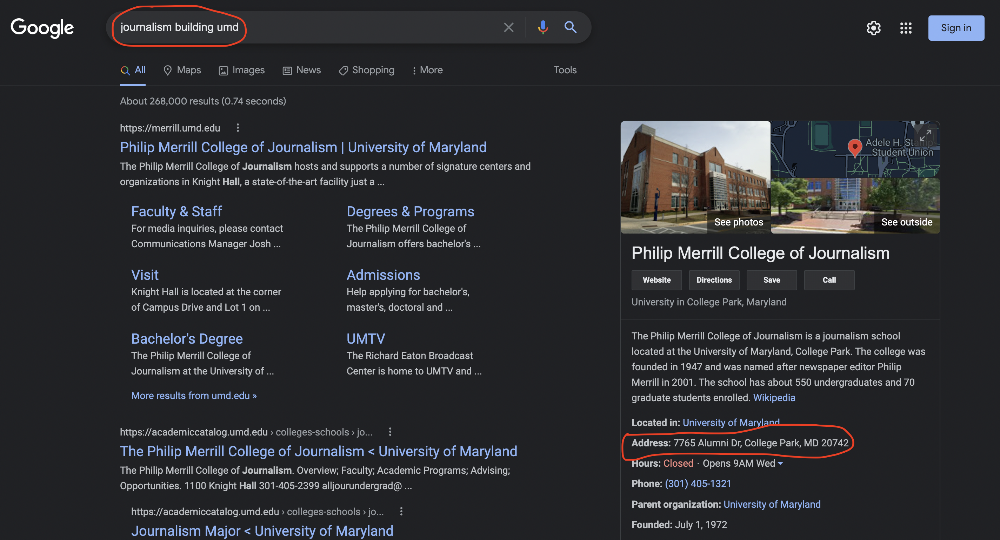

# A tool to format quick-and-dirty addresses

For the Howard Center, I wrote a Python script that passes a broke address through Google, and return a formatted string from the search. 

The function will run a Selenium scraper and return the address string from Google's local listing, if there is one, like so:

For instance, if you have an establishment name, city and state, and need the street it's on, you can run it through this function. If you ran "journalism building umd" through the function, it would return "7765 Alumni Dr, College Park, MD 20742."

For an investigation, we needed to find city names of establishment we had names, street addresses and states for. This tool automated the search process for the most part. We manually filled in addresses for instances where this function did not return a result.